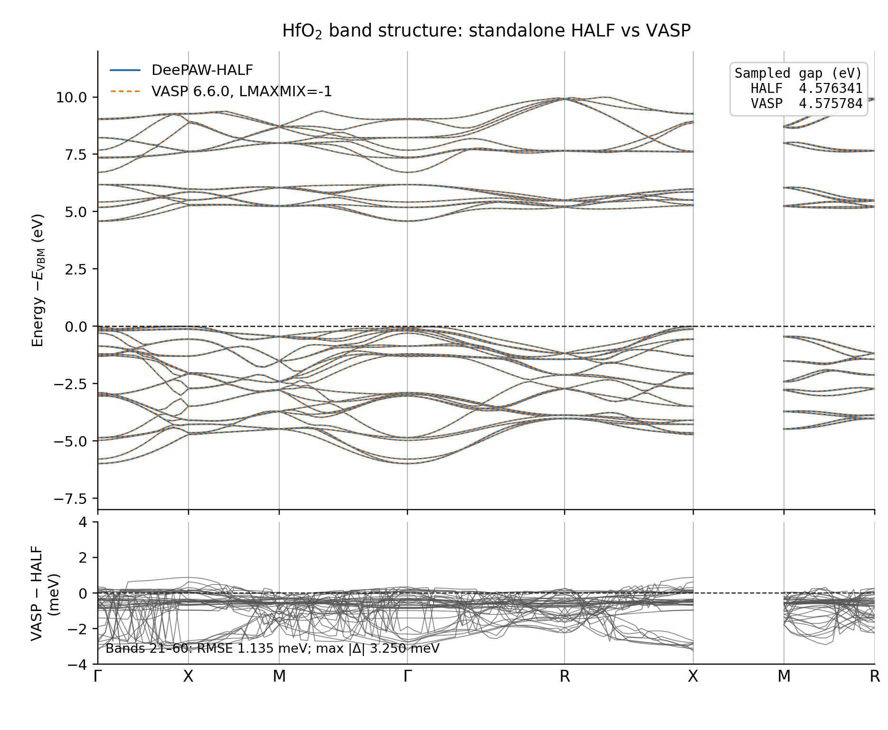

# DeePAW-HALF acceleration of VASP SCF convergence

## Results

For a VASP 6.6.0 SCF calculation of HfO₂, the benchmark used
`KSPACING=0.35`, 36 irreducible k points, `ALGO=All`, and `EDIFF=1E-4`.
DeePAW-HALF initialization was compared with native VASP SAD initialization.

### `LMAXPAW=-1`

| Metric | DeePAW-HALF | VASP SAD | HALF acceleration |
|---|---:|---:|---:|
| Electronic iterations | **4** | 16 | **75% fewer; 4.0× iteration-convergence speedup** |
| End-to-end wall time | **193.44 s** | 266.96 s | **1.38× speedup; 27.54% less time** |
| Final energy | -121.10188267 eV | -121.10187886 eV | Difference: 3.813×10⁻⁶ eV/cell |

### Default VASP LMAX

| Metric | DeePAW-HALF | VASP SAD | HALF acceleration |
|---|---:|---:|---:|
| Electronic iterations | **5** | 16 | **68.75% fewer; 3.2× iteration-convergence speedup** |
| End-to-end wall time | **145.76 s** | 262.70 s | **1.80× speedup; 44.51% less time** |
| Final energy | -121.04035930 eV | -121.04037650 eV | Difference: 1.7194×10⁻⁵ eV/cell |

## Standalone HALF band structure of HfO₂

The band structure below was computed entirely by DeePAW-HALF, without
starting or entering a VASP workflow. The calculation used PBE, a 500 eV
cutoff, MIMIC_US, 60 bands, and 100 high-symmetry-path samples. Energies are
referenced to the valence-band maximum (VBM).

HALF gives a sampled band gap of **4.576 eV** and a direct Γ-point gap of
**4.629 eV**.

### Comparison with VASP (`LMAXMIX=-1`)

VASP 6.6.0 used the converged fixed charge density with `LMAXMIX=-1`. VASP
and standalone HALF used the same 100 k points and 60 bands. Each spectrum
was aligned to its own VBM.

| Metric | DeePAW-HALF | VASP 6.6.0 | Difference |
|---|---:|---:|---:|
| Sampled band gap | 4.576341 eV | 4.575784 eV | 0.557 meV |
| Direct Γ-point gap | 4.629091 eV | 4.631752 eV | 2.661 meV |

Across bands 21–60 and every sampled k point, the VASP–HALF eigenvalue RMSE
is **1.135 meV**, with a maximum absolute difference of **3.250 meV**.
Standalone HALF therefore reproduces the VASP HfO₂ band dispersion and band
gap without entering the VASP workflow.

## Conclusion

DeePAW-HALF reduced the VASP electronic iteration count from 16 to 4–5, a
reduction of 68.75%–75%. Including HALF initial-wavefunction generation, the
measured end-to-end speedup was **1.38×–1.80×**, reducing wall time by
**27.54%–44.51%**.

For both settings, the final HALF and SAD energies differed by less than
`2×10⁻⁵ eV/cell`. DeePAW-HALF therefore preserved the converged VASP result
while substantially accelerating convergence.

Each path currently has one timing sample. The wall times report the observed
end-to-end effect, while the electronic iteration count is the more stable
acceleration metric.

中文版：
[`HFO2_VASP_HALF_VS_SAD_KSPACING035.zh-CN.md`](HFO2_VASP_HALF_VS_SAD_KSPACING035.zh-CN.md).
