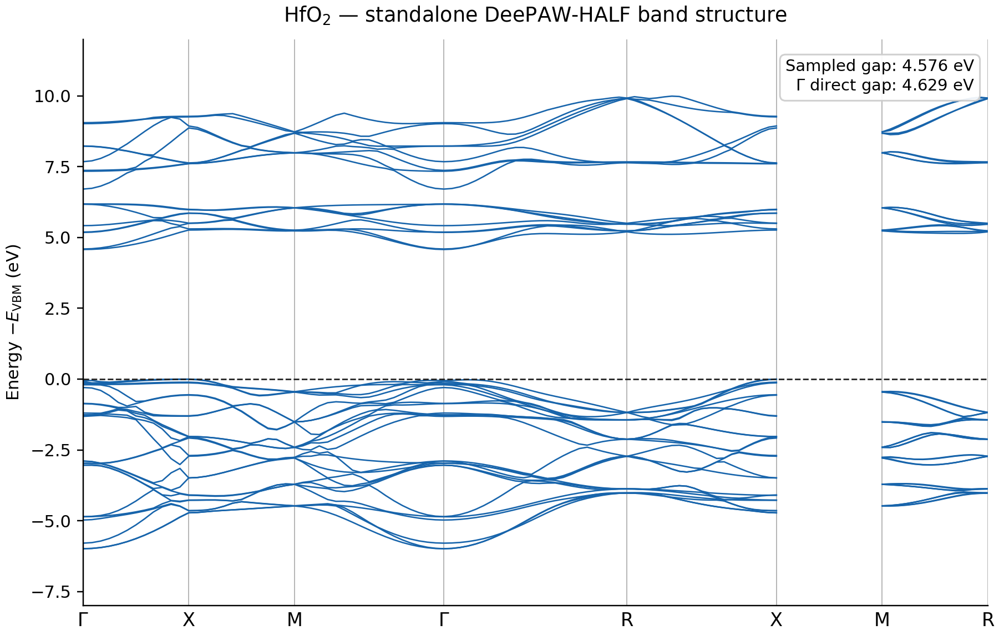
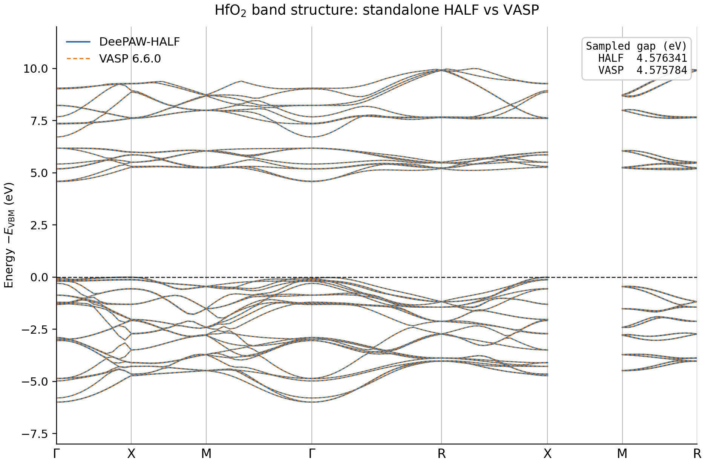

# DeePAW-HALF：从 DeepAW 密度计算能带、能量，开发解析力并加速 VASP 自洽计算

## 摘要

DeePAW-HALF 把 DeepAW 预测的平滑电子密度转化为可直接使用的平面波电子结构。
它提供三项相互关联的功能：

1. **DeepAW → HALF → band structure**：HALF 从平滑密度和匹配 POTCAR 重建
   固定密度 PAW Hamiltonian，不启动 VASP 即可计算高对称路径能带、带隙、
   本征值、总能量和初始波函数。
2. **DeepAW → HALF → VASP SCF**：HALF 把固定密度本征态直接写入 VASP 的
   波函数内存，代替 SAD/随机初始轨道；VASP 随后沿原有 `ALGO=All` 流程继续
   自洽，从而减少电子迭代。
3. **DeepAW → HALF → energy/analytic forces**：HALF 直接从学习密度计算 Harris
   总能量；原生 Hellmann--Feynman 力目前已包含 Ewald、倒空间局域势和广义 PAW
   `D-epsilon Q` 导数。原先的有限差分结果只保留作导数 oracle，不是生产总力。

HfO₂ 验证中，HALF 独立能带与 VASP 的带能量平均绝对差为 **0.840 meV**，
采样带隙相差 **0.557 meV**。Si 的 CUDA 与 Python 实现达到
$3.425\times10^{-12}$ eV/cell 一致性。原先 $2.238\times10^{-9}$ eV/Angstrom
和 **45.31 倍** 是有限差分 oracle 的验证结果，不是尚未完成的解析总力性能。
在 VASP SCF 中，HALF 初始化把电子迭代从
16 次降至 4 次，端到端加速 **1.38 倍**。在 85 个材料的批量测试中，
平均 SCF LOOP 从 25.365 降至 11.435，即平均迭代加速 **2.218 倍**。对于更大的
20 原子 CsPbBr₃，矩阵自由 ACC 求解器在保持 5 次 SCF LOOP 和相同最终能量的
同时，把总耗时从 1861.0 s 降到 275.5 s，即 **6.75 倍加速**。

## 1. DeePAW-HALF 的定位

DeepAW 的主要输出是平滑价电子密度，而常规能带和 VASP SCF 需要波函数。HALF
位于两者之间，负责完成“密度到波函数”的确定性物理映射：

```text
                    ┌─> HALF 固定密度求解 ─> band structure / gap / energy
结构 ─> DeepAW 密度 ┤
                    ├─> HALF Harris 能量 ─> 有限差分原子力
                    └─> HALF 初始波函数 ─> VASP SCF ─> 自洽性质
```

HALF 不是另一个能带机器学习模型。它读取 DeepAW 平滑 `CHGCAR` 或 eSCN API
密度，以及与元素、赝势版本严格匹配的 VASP PAW `POTCAR`，然后重建
DeePAW-HALF 固定密度 PAW/MIMIC_US 算符。

给定 DeepAW 密度 $\widetilde\rho_0$，HALF 只构造一次 Hamiltonian：

$$
\widehat H_0=\widehat H[\widetilde\rho_0],
$$

并求解 PAW 广义本征问题：

$$
H(\mathbf k)C(\mathbf k)
=S(\mathbf k)C(\mathbf k)\varepsilon(\mathbf k).
$$

其平面波表示可以写成：

$$
H=T+V_{\mathrm{eff}}+BDB^{\dagger},
$$

$$
S=I+BQB^{\dagger}.
$$

这里 $B$ 是 PAW 投影矩阵，$D$ 包含 DION 和势依赖 QDEP 校正，$Q$ 是 PAW
重叠增强矩阵。完整推导、矩阵自由 $H\Psi/S\Psi$、S 度量正交化和全带
Rayleigh–Ritz 见
[Harris 无矩阵全带加速原理与推导](../HARRIS_ACC_THEORY.zh-CN.md)。

## 2. 功能一：DeepAW 直接到 band structure

### 2.1 工作流

直接能带路径完全不进入 VASP：

```text
POSCAR/结构
  -> DeepAW 预测平滑密度
  -> CHGCAR 或内存密度 + POTCAR
  -> HALF 构造 Veff、PAW projector、D 和 Q
  -> 对每个高对称 k 点求解 H(k)C=S(k)Cε
  -> JSON / CSV / NPZ / PNG / vaspwave.h5
```

HALF 支持显式 `KPOINTS`、自动高对称路径、任意单 k 点和均匀 k 网格。CPU 版本
可按 k 点 MPI 分发；CUDA 稠密求解器用于中小基组，矩阵自由 ACC 用于
$N_{\mathrm{PL}}\gg N_{\mathrm{BANDS}}$ 的大基组。

### 2.2 HfO₂ 独立能带结果

验证体系为 12 原子 HfO₂。HALF 独立计算采用 PBE、500 eV、MIMIC_US、60 条
能带和 100 个高对称路径采样点；能量以价带顶 VBM 为零。



HALF 得到：

- 采样带隙：**4.576341 eV**；
- Γ 点直接带隙：**4.629091 eV**。

### 2.3 与 VASP 能带逐点对比

VASP 6.6.0 和 HALF 使用同一条 100 k 点路径及 60 条能带，两组谱分别以各自
VBM 对齐。



| 指标 | DeePAW-HALF | VASP 6.6.0 | 差值 |
|---|---:|---:|---:|
| 采样带隙 | 4.576341 eV | 4.575784 eV | 0.557 meV |
| Γ 点直接带隙 | 4.629091 eV | 4.631752 eV | 2.661 meV |
| 能带 MAE | — | — | 0.840 meV |
| 能带 RMSE | — | — | 1.135 meV |
| 最大逐点能带差 | — | — | 3.250 meV |

这表明 HALF 在不进入 VASP 主程序的情况下重现了 HfO₂ 的能带色散和带隙。
这里验证的是“给定平滑密度后”的电子结构重建精度；最终物理精度还取决于
DeepAW 密度、POTCAR 匹配、泛函和基组设置。

### 2.4 不同实现的速度和数值一致性

HfO₂ Gamma/MIMIC_US 基准采用 520 eV、3407 个平面波和 60 条能带。全部程序
使用相同 CHGCAR、POTCAR、PBE 和 complex128 精度。

| DeePAW-HALF 实现 | 硬件/并行 | 时间 | 相对速度 |
|---|---|---:|---:|
| Python 实现 | 单逻辑 CPU | 64.23 s | 1.00× |
| CPU Fortran 实现 | 单逻辑 CPU | 43.790 s | 1.47× |
| CUDA Fortran 实现 | RTX PRO 6000 | 1.696 s | **37.87×** |

CUDA 实现的 60 条本征值与 Python 实现最大相差
$7.80\times10^{-12}$ eV，RMS 差为 $2.31\times10^{-12}$ eV。该结果证明
CUDA 加速没有改变 DeePAW-HALF 数值模型。此处是单 k 点算符基准，不等同于 100 k 点
整条能带路径的端到端计时。

### 2.5 命令行入口

```bash
half bands CHGCAR.deepaw POTCAR KPOINTS \
  --encut 500 --bands 60 --backend cuda --solver acc --uspp-dij \
  --output-prefix hfo2_bands
```

输出包含 `hfo2_bands.json`、`.csv`、`.npz` 和 `.png`。小体系可把
`--solver acc` 改成稠密部分谱 `--solver evx`。

## 3. 功能二：DeePAW-HALF 介入 VASP，加速 SCF

### 3.1 为什么初始波函数影响收敛

VASP 原生 SAD 从孤立原子电荷叠加和默认初始轨道开始。对于成键、离子转移或
复杂 PAW 体系，这个初始子空间可能离自洽低能子空间较远。DeepAW 给出的密度已
包含结构环境信息；HALF 从该密度求得 Harris 本征态，因此初始波函数通常更接近
最终自洽子空间。

HALF 返回的轨道不必达到最终 SCF 本征态精度。只要其张成的低能子空间足够好，
VASP 后续的 `ORTHCH`、`PROALL`、`ALGO=All` 和密度混合会继续优化。这个设计允许
ACC 以较宽松残差或固定迭代上限提前停止。

### 3.2 直接内存传递

适配后的 VASP 不通过 WAVECAR 中转：

1. VASP 把晶格、分数坐标、物种、FFT 网格、ENCUT 和 NBANDS 传给 libhalf；
2. 对每个 k 点，VASP 传递自身的 $(G_x,G_y,G_z)$ 顺序；
3. HALF 验证基组完全一致并返回已经按 VASP 顺序排列的 complex128 系数；
4. VASP 用 `DIS_PW_BAND` 分发波函数，写入 `W%CELTOT`，跳过随机 `WFINIT`；
5. VASP 从这些轨道开始正常 SCF，不改变最终收敛判据。

对应 INCAR 为：

```text
LHALF_INIT = .TRUE.
LHALF_API  = .FALSE.  # 读取已有 DeepAW CHGCAR
HALF_MODE  = ACC
```

如设置 `LHALF_API=.TRUE.`，密度由 `HALF_ESCN_URL` 指向的 DeePAW-eSCN 服务直接
获得；VASP—HALF 波函数传递过程不变。

### 3.3 HfO₂：HALF 初始态与 SAD 对比

测试使用 VASP 6.6.0 full-complex `vasp_std`、`KSPACING=0.35`、36 个不可约
k 点、`PREC=High`（实际 ENCUT=500 eV）、`ALGO=All`、`EDIFF=1E-4`、ISPIN=1。

| 指标 | DeePAW-HALF | VASP SAD | HALF 效果 |
|---|---:|---:|---:|
| SCF LOOP | **4** | 16 | 减少 75%，迭代数加速 4.0× |
| 端到端 wall time | **193.44 s** | 266.96 s | **1.38×**，节省 27.54% |
| 最终 TOTEN | -121.101882671 eV | -121.101878858 eV | 相差 3.813 µeV/cell |

微电子伏量级的最终能量差说明 HALF 改变的是到达自洽解的路径，而不是最终
VASP 解。

Si 的独立 eSCN 验证也得到相同趋势：HALF 从 eSCN 密度生成轨道后用了 4 个
SCF LOOP，而原基准 SAD 为 12 个；同机 SAD 复跑为 11 个，`LOOP+` 时间从
2.4036 s 降到 0.9251 s，即 SCF 段加速 2.60×。

### 3.4 MP-85：平均 SCF 加速

更大范围的测试包含 85 个 Materials Project 结构，使用预先生成的 DeepAW
CHGCAR，设置为 `LHALF_API=.FALSE.`、`EDIFF=1E-4`、`KSPACING=0.35`、
`ALGO=All` 和 ISPIN=1。HALF 与 SAD 两组都达到 85/85 收敛并
正常结束；85 个 HALF `vasp.out` 均包含初始化横幅和 k 点初始化记录。

| 85 个材料的汇总 | DeePAW-HALF | VASP SAD | HALF 效果 |
|---|---:|---:|---:|
| SCF LOOP 总数 | 972 | 2156 | 减少 1184 次 |
| 平均 SCF LOOP | **11.435** | 25.365 | **减少 54.92%** |
| 平均迭代加速 | — | — | **2.218×** |

这里的平均加速明确定义为：

$$
S_{\mathrm{mean}}=
\frac{\langle N_{\mathrm{SCF}}^{\mathrm{SAD}}\rangle}
{\langle N_{\mathrm{SCF}}^{\mathrm{HALF}}\rangle}
=\frac{25.3647}{11.4353}=2.2181.
$$

这个指标比较的是迭代数，不是 wall time；它避免把不同材料的体系大小混在同一个
耗时平均中，更直接地衡量初始化对全数据集的作用。HfO₂ 和 XeF₂ 因 520 eV
截断边界处的 VASP/HALF 基组差异，采用已独立验证的 521 eV 重跑结果。

### 3.5 大基组下为什么还需要 ACC

更好的初始轨道可以减少 SCF LOOP，但如果 HALF 自己通过稠密
$N_{\mathrm{PL}}\times N_{\mathrm{PL}}$ H/S 求解，初始化成本会在大体系中反过来
成为瓶颈。ACC 使用分块 $H\Psi/S\Psi$ 和全带 Rayleigh–Ritz，只把
$N_{\mathrm{BANDS}}$ 或 $2N_{\mathrm{BANDS}}$ 小矩阵交给 cuSOLVER。

20 原子 CsPbBr₃ 测试包含 12 个 k 点、105 条带，
$N_{\mathrm{PL}}=20640$--$20780$；两份稠密 complex128 H/S 本身就需要约
13.8 GB。

| HALF 初始化方案 | VASP 总耗时 | SCF LOOP | 最终 E0 |
|---|---:|---:|---:|
| 稠密基线 | 1861.047 s | 5 | -63.791680 eV |
| 矩阵自由 `ACC` | **275.522 s** | 5 | -63.791680 eV |

ACC 总体加速 **6.75×**。扣除 VASP `LOOP+` 后，HALF 初始化及其他外围阶段由
约 1573.7 s 降到 53.8 s，粗估加速 **29.3×**。这个估计不是独立插桩的
HALF-only 计时，但清楚显示了稠密初始化瓶颈的消失。

40 次 ACC 后各 k 点最大残差仍为 0.022--0.410 eV；然而 VASP 仍然只使用
5 个 SCF LOOP，并得到完全相同的最终 E0。这直接验证了“初始子空间无需收敛到
最终 SCF 精度”的设计。

## 4. 功能三：直接计算能量和力

### 4.1 Harris 总能量

求得固定密度占据态后，HALF 计算：

$$
E_{\mathrm{HALF}}=
\sum_{n\mathbf{k}}w_{\mathbf{k}}f_{n\mathbf{k}}\varepsilon_{n\mathbf{k}}
-E_{\mathrm H}
-\int \widetilde\rho(\mathbf r)v_{\mathrm{xc}}(\mathbf r)\,d\mathbf r
+E_{\mathrm{xc}}
+E_{\mathrm{Ewald}}
+E_{G=0}
+E_{\mathrm{atom}}
+E_{\mathrm{PAW}}.
$$

实现包括占据数与熵、Hartree 和 XC 双计数校正、Ewald 离子能、局域势 $G=0$
项和原子参考项。球形原子 PAW 校正由 POTCAR 的原子占据、AE/PS partial waves、
core density、`DEXC` 与补偿电荷自动重建，不读取 CHGCAR augmentation 尾部，
也不复制 VASP 输出数值。输入既可以是显式 k 点，也可以是
对称性约化网格；CPU 版本可以用 MPI 分发独立 k 点。

### 4.2 原子力

HALF 的正式力路径是解析导数：

$$
F_{I\alpha}=-\frac{\partial E_{\mathrm{HALF}}}{\partial R_{I\alpha}}
=F^{\mathrm{Ewald}}+F^{\mathrm{local}}+F^{D-\varepsilon Q}
+F^{\mathrm{aug}}+F^{\mathrm{NLCC}}+F^{\mathrm{Harris\ core}}.
$$

其中广义非局域项为

$$
F^{D-\varepsilon Q}_{I\alpha}
=-\sum_{n\mathbf k}w_{\mathbf k}f_{n\mathbf k}
\left\langle\psi_{n\mathbf k}\left|
\partial_{I\alpha}H-\varepsilon_{n\mathbf k}\partial_{I\alpha}S
\right|\psi_{n\mathbf k}\right\rangle .
$$

DeepAW 平滑输入密度保持冻结，所以其导数为零；Harris 响应只保留 POTCAR core
density 平移产生的 XC-kernel 项。中心有限差分只作为开发验证 oracle，不进入
正式 CLI。一次调用即可输出能量分量和解析力：

```bash
half energy CHGCAR.deepaw POTCAR \
  --encut 520 --kspacing 0.35 --bands 24 --backend cuda \
  --forces --output-prefix si_energy_force
```

相对未收敛的初始 VASP `LMAXMIX=-1` MIMIC_US 状态，当前 Si 能量差
`0.0207 eV/cell`，力分量 MAE 为 `0.00532 eV/Angstrom`；HfO2 分别为
`0.0861 eV/cell` 与 `0.0680 eV/Angstrom`。相对同一个 HALF 能量，atom-1/x
解析力与中心差分的误差为 Si `0.00175 eV/Angstrom`、HfO2
`0.00307 eV/Angstrom`。这些是开发验证结果，不代表已经达到 VASP 力一致性；
完整数据见
[`HARRIS_VASP_MIMIC_US_ENERGY_FORCE.zh-CN.md`](HARRIS_VASP_MIMIC_US_ENERGY_FORCE.zh-CN.md)。

### 4.3 与已有机器学习势报道结果的对比

DeepAW-HALF 与通用机器学习势都利用机器学习结果代替或显著减少传统 SCF-DFT
工作量。下面把 HALF 当前的能量/力验证与代表性公开结果并列展示。

| 方法 | 已报道能量结果 | 已报道力结果 |
|---|---:|---:|
| DeePAW-HALF，当前 Si/HfO2 验证 | 相对初始 VASP MIMIC_US 状态绝对能量差 2.59/7.17 meV/atom | 分量 MAE 5.32/68.0 meV/Angstrom；onsite VASP 一致性仍在完善 |
| [M3GNet](https://doi.org/10.1038/s43588-022-00349-3) | MAE 35 meV/atom | MAE 72 meV/Angstrom |
| [CHGNet](https://doi.org/10.1038/s42256-023-00716-3) | MAE 30 meV/atom | MAE 77 meV/Angstrom |
| [MACE-MP-0 medium](https://doi.org/10.1063/5.0297006) | MAE 20 meV/atom | MAE 45 meV/Angstrom |

这些结果表明，DeePAW-HALF 已形成从学习密度到能带、能量、力和波函数的完整
电子结构路径；需要完全自洽结果时，还可以把初始波函数直接交给 VASP。

## 5. 三项功能之间的关系

| 项目 | 直接 band structure | 直接能量和力 | VASP SCF 加速 |
|---|---|---|---|
| 输入 | DeepAW 密度 + POTCAR + k 路径 | DeepAW 密度 + POTCAR + k 网格 | DeepAW 密度 + POTCAR + VASP 内存结构 |
| HALF 输出 | 固定密度本征值和本征矢 | Harris 能量和原子力 | VASP 初始本征子空间 |
| 是否进入 VASP | 否 | 否 | 是 |
| 主要价值 | 快速筛选、能带和带隙 | 无 SCF 的能量/力计算 | 减少 SCF LOOP 和 wall time |
| 大体系路径 | ACC 或按 k 点 MPI | ACC + k 点 MPI | ACC + VASP `ALGO=All` |

三条路径共用相同的 CHGCAR/POTCAR 解析、有效势、PAW projector、MIMIC_US、
基组和 $H\Psi/S\Psi$ 实现，因此直接能带验证也为 VASP 初始波函数提供数值基础。

## 6. 适用范围和限制

- HALF 计算的是给定 DeepAW 密度上的固定密度电子结构；其物理准确度受密度模型、
  泛函、POTCAR 和基组共同影响。
- CHGCAR 与 POTCAR 必须具有一致的元素顺序、赝势版本和价电子定义。
- 当前 VASP adapter 支持 ISPIN=1、无 SOC/非共线自旋、full-complex 存储和
  KPAR=1；这些是接线限制，不是 PAW/ACC 方程本身的限制。
- HfO₂ 和 CsPbBr₃ wall time 均为对应路径的单次裸机实测。迭代数、最终能量和
  逐本征值误差比跨时段 wall time 更稳定。
- ACC 的残差阈值和迭代上限应按用途选择：独立能带需要更严格，VASP 初始化可以
  更宽松。
- 中心有限差分只保留为验证 oracle。原生 Ewald、局域势、广义非局域 PAW、
  augmentation、NLCC 与固定密度 Harris-core 解析导数均已实现。文档所列分量
  与自身能量导数达到数 meV/Angstrom 一致性，但 VASP onsite PAW 的严格一致性
  仍在完善。

## 7. 结论

DeePAW-HALF 已形成从学习密度到平面波电子结构的三条可用路径：

- **直接计算**：无需 VASP，HALF 可从 DeepAW 密度直接生成高对称路径能带；
  HfO₂ 能带相对 VASP 的 MAE 为 0.840 meV，两个独立 Gamma/MIMIC_US 实现
  达到约 $10^{-11}$ eV 一致性。
- **加速自洽**：HALF 把环境感知的初始波函数直接送入 VASP；HfO₂ 的 SCF LOOP
  从 16 降至 4，MP-85 的平均 LOOP 从 25.365 降至 11.435（2.218×），
  CsPbBr₃ 上 ACC 又把大基组初始化的总作业时间降低 6.75 倍。
- **能量与解析力**：HALF 无需先运行 SCF 即可计算 Harris 总能量；Ewald、局域势
  及 POTCAR augmentation 等正式力分量均为解析实现。Si/HfO2 所列分量相对
  自身能量中心差分误差为 `0.00175--0.00307 eV/Angstrom`；在宣称 VASP 力
  一致性前仍需逐项闭合 onsite PAW。

因此 DeePAW-HALF 是一层可复用的“密度—电子结构”接口：向上连接 DeepAW
密度模型，向下可输出能带、能量、解析力和波函数，也可为
VASP 提供更好的 SCF 起点。

## 8. 数据与复现记录

- HfO₂ 能带数据：
  [`assets/hfo2_half_direct_bs.json`](assets/hfo2_half_direct_bs.json)
- HALF/VASP 逐带对比：
  [`assets/hfo2_half_vasp_band_comparison.json`](assets/hfo2_half_vasp_band_comparison.json)
- HfO₂ HALF/SAD SCF 原始记录：
  [`hfo2_vasp_half_vs_sad_kspacing035.json`](hfo2_vasp_half_vs_sad_kspacing035.json)
- HfO₂ 跨实现一致性与速度：
  [`hfo2_cuda_uspp_parity.json`](hfo2_cuda_uspp_parity.json)
- CsPbBr₃ ACC/VASP 记录：
  [`cspbbr3_vasp_acc_pro6000.json`](cspbbr3_vasp_acc_pro6000.json)
- MP-85 HALF/SAD 汇总记录：
  [`mp85_deepaw_half_vs_sad_ediff1e4.json`](mp85_deepaw_half_vs_sad_ediff1e4.json)
- Si 总能量一致性：
  [`si_total_energy_parity.json`](si_total_energy_parity.json)
- Si 有限差分力一致性与性能：
  [`si_force_parity.json`](si_force_parity.json)

English version:
[`HFO2_VASP_HALF_VS_SAD_KSPACING035.md`](HFO2_VASP_HALF_VS_SAD_KSPACING035.md).
