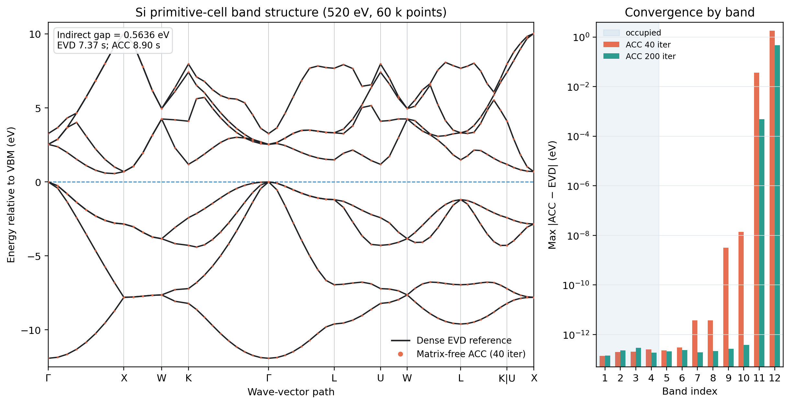
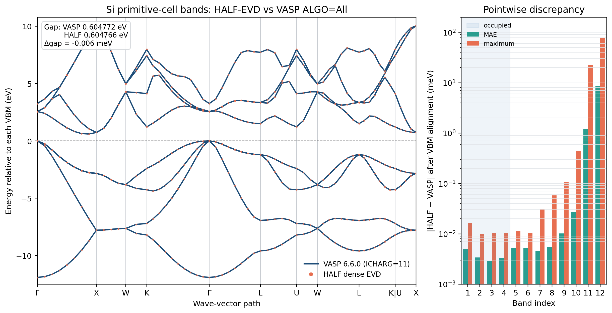

# Si primitive-cell CLI bands: EVD versus matrix-free ACC

The single-GPU RTX PRO 6000 test used the two-atom Si primitive cell, a
DeepAW smooth density, its PAW POTCAR, `ENCUT=520 eV`, 12 bands, and 60 points
along `GXWKGLUWLK,UX`.

| solver | wall time | max error, occupied 4 | max error, lowest 8 | max error, all 12 |
|---|---:|---:|---:|---:|
| dense EVD | 7.37 s | reference | reference | reference |
| ACC, at most 40 iterations | 8.90 s | `2.49e-13 eV` | `3.79e-12 eV` | `1.820 eV` |
| ACC, at most 200 iterations | 31.69 s | `2.96e-13 eV` | `2.96e-13 eV` | `0.464 eV` |

Default ACC and EVD give indirect gaps of `0.5635976766544735 eV` and
`0.5635976766545410 eV`, respectively. ACC therefore reproduces the occupied
subspace, low conduction bands, and gap needed by HALF--VASP initialization.
The visible error is confined to the highest requested empty bands. This small
case has only about 1100 plane waves per k point, so its iterative FFT and
orthogonalization overhead makes default ACC 21% slower than dense EVD. ACC is
intended to avoid the `NPL x NPL` dense matrices of larger systems, not to win
this small-matrix timing.

The `half bands` command now accepts `--acc-tol`, `--acc-max-iter`, and
`--acc-block-size`. Raw records are available for
[`EVD`](assets/si_primitive_bands_evd.json),
[`ACC-40`](assets/si_primitive_bands_acc.json), and
[`ACC-200`](assets/si_primitive_bands_acc_strict.json).

## Pointwise comparison with VASP 6.6.0

A VASP `ALGO=All` self-consistent Si CHGCAR was also used as a common fixed
density. VASP used `ICHARG=11` and `LMAXMIX=-1`, while HALF used dense EVD.
Both calculations used 520 eV, 12 bands, and the same 60 explicit k points;
each spectrum was aligned to its own VBM.

The VASP and HALF indirect gaps are `0.604772 eV` and `0.604765817 eV`, a
`-0.00618 meV` difference. The occupied-band MAE/maximum errors are
`0.00367/0.01672 meV`; for the lowest eight bands they are
`0.00439/0.05765 meV`. VASP's energy-based stopping condition leaves bands
11--12 with looser empty-state residuals, so they are excluded from the
low-energy accuracy claim. See the
[`machine-readable record`](assets/si_half_evd_vs_vasp_bands.json).
